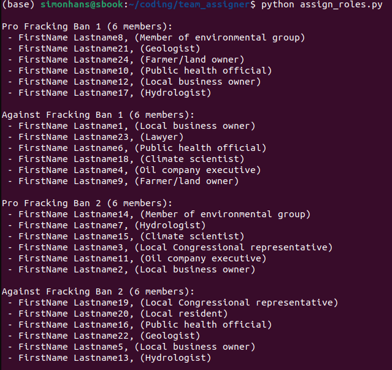

# team_assigner

This is a python script to randomly assign students to teams and roles for the ESS
101 debate lab.

Update students.txt with a list if the students in your section and run
assign_roles.py in a terminal.

Output will be a team structure to copy and paste into an email.

